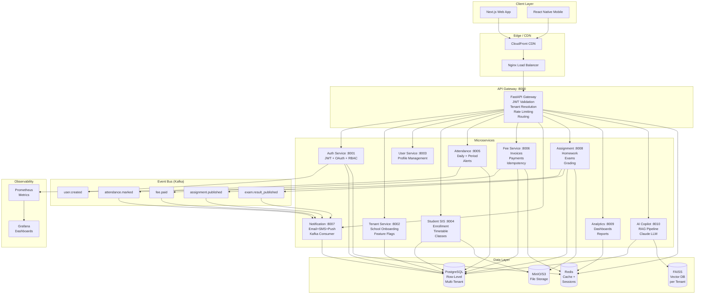

# Schoolify — System Architecture

## High-Level Architecture



## Multi-Tenancy Design

### Row-Level Isolation Strategy

**Decision: Row-level isolation via `tenant_id` column on every table.**

Rationale over schema-per-tenant:
- ✅ Single connection pool shared across all tenants (PostgreSQL efficiency)
- ✅ Migrations apply once to all tenants simultaneously
- ✅ Simpler joins across tenant-scoped tables
- ✅ No connection string switching per tenant
- ❌ Requires discipline: every query must include `WHERE tenant_id = ?`

### Enforcement Layers
1. **ORM Level**: `TenantAwareModel` base class includes `tenant_id` as required field
2. **Middleware Level**: `TenantMiddleware` sets `request.state.tenant_id` on every request
3. **Service Level**: All queries filter by `tenant_id` from `current_user.tenant_id` JWT claim
4. **Database Level**: PostgreSQL RLS policies can be added as an extra safety net

### Tenant Identification
```
Request → HTTP Header: X-Tenant-Slug: greenwood-high
       → Subdomain: greenwood-high.schoolify.com
       → API Gateway resolves slug → tenant_id (Redis cache, fallback to DB)
       → Injects X-Tenant-ID header when forwarding to services
```

## Service Communication

### Synchronous (REST)
- Used for: user-facing reads and writes
- Protocol: HTTP/1.1 via API Gateway proxy
- Timeout: 30 seconds
- Retry: 3x with exponential backoff in clients

### Asynchronous (Kafka Events)
- Used for: cross-service state propagation
- Pattern: Event sourcing (publish-subscribe)
- Ordering: partitioned by `tenant_id` for per-tenant ordering
- Retention: 7 days

Event flow example:
```
Teacher marks attendance
  → AttendanceService saves to DB
  → Publishes attendance.marked event (tenant_id, class_id, absent_students[])
  → NotificationService consumes event
  → Sends SMS/email to parents of absent students
  → No synchronous dependency between Attendance and Notification services
```

## Security Architecture

### Authentication Flow
```
1. Client → POST /api/v1/auth/login (email, password, tenant_slug)
2. Auth Service validates credentials
3. Issues: Access Token (JWT, 30min) + Refresh Token (opaque, 7 days)
4. Client stores both tokens
5. Access token expires → Client calls POST /api/v1/auth/refresh
6. Rotation: old refresh token revoked, new pair issued
```

### JWT Structure
```json
{
  "sub": "user-uuid",
  "tenant_id": "tenant-uuid",
  "role": "admin",
  "email": "admin@school.com",
  "exp": 1234567890,
  "iat": 1234567860,
  "jti": "unique-token-id"
}
```

### RBAC Matrix
| Endpoint | Admin | Teacher | Student | Parent |
|---------|-------|---------|---------|--------|
| Create User | ✅ | ❌ | ❌ | ❌ |
| View Students | ✅ | ✅ | Self only | Own child |
| Mark Attendance | ✅ | ✅ | ❌ | ❌ |
| View Attendance | ✅ | ✅ | Self only | Own child |
| Create Invoice | ✅ | ❌ | ❌ | ❌ |
| Pay Invoice | ✅ | ❌ | ❌ | ✅ |
| AI Copilot | ✅ | ✅ | ❌ | ❌ |
| Tenant Settings | ✅ | ❌ | ❌ | ❌ |

## Scalability Design

### Target: 1M+ users, 10,000+ schools

**Database**
- PostgreSQL with read replicas (1 writer, 2+ readers)
- PgBouncer connection pooling (reduces connection overhead)
- Partitioning: Large tables (attendance, audit_logs) by month
- Indexes: All tenant_id + frequently queried columns

**Application**
- Horizontal pod autoscaling (3 → 20 replicas per service)
- Scale trigger: CPU > 70% OR memory > 80%
- Stateless services (all state in DB/Redis/Kafka)

**Caching Strategy**
- Dashboard metrics: Redis, 5-minute TTL
- Tenant branding: Redis, 1-hour TTL
- User profiles: Redis, 10-minute TTL
- Feature flags: Redis, 15-minute TTL

**Queue (Kafka)**
- Notifications processed async (no user wait)
- Partition count = expected tenant count / 10
- Consumer groups per service instance

## AI Copilot Architecture

```
Admin triggers indexing
  → School data fetched from services
  → Records converted to natural language text
  → Embedded with sentence-transformers/all-MiniLM-L6-v2 (384-dim vectors)
  → Stored in FAISS index file (per tenant, tenant-isolated)

User asks: "Which students have low attendance?"
  → Query embedded → FAISS similarity search (top-5 relevant chunks)
  → Retrieved context: attendance records, student names, percentages
  → Context + query + conversation history sent to Claude API
  → Claude generates grounded response citing actual school data
  → Response + sources returned to user
```
