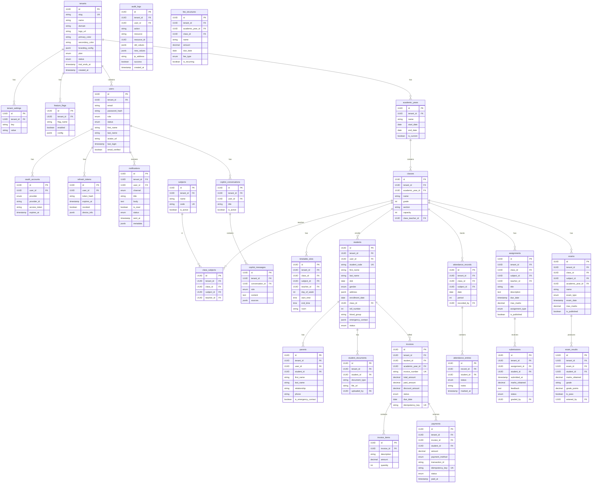

# Database Schema — Schoolify

All tables except `tenants` include `tenant_id` for row-level isolation.

## ER Diagram

## Key Design Decisions

### Idempotency Keys (Invoices + Payments)
Both `invoices.idempotency_key` and `payments.idempotency_key` have unique constraints.
Client generates UUID before calling API → even if network times out and client retries,
the second call returns the existing record instead of creating a duplicate.

### JSONB Fields
- `address`, `emergency_contact`: Flexible structured data without schema migrations
- `branding_config`: Custom CSS variables, themes per tenant
- `audit_logs.old_values/new_values`: Snapshot of record before/after change
- `gateway_response`: Raw payment gateway JSON for debugging

### Soft Deletes
No hard deletes on business entities. Status fields:
- users: `status = inactive`
- students: `status = inactive`
- Preserves audit trail and foreign key integrity
